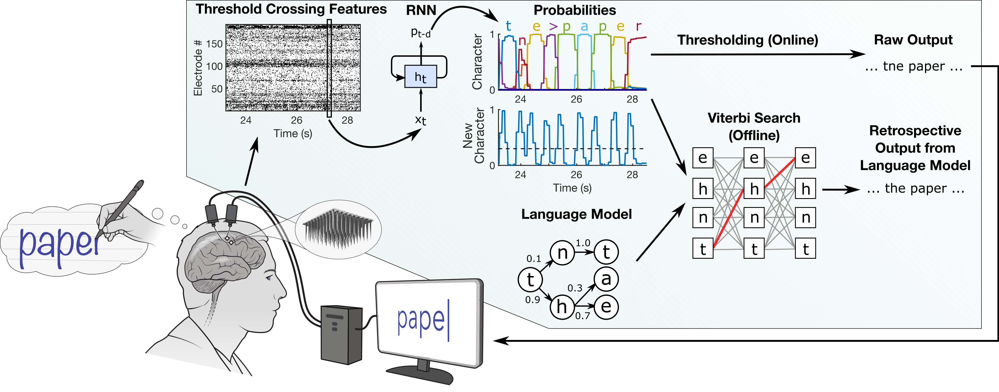

## High-Performance Brain-to-Text Communication via Handwriting

## Overview

This repo is associated with this [manuscript](https://www.biorxiv.org/content/10.1101/2020.07.01.183384v1.abstract) and [dataset](https://doi.org/10.5061/dryad.wh70rxwmv) (note - the dataset is currently not publicly released, but should be available as soon as Data Dryad accepts the submission). The code can be used to run an offline reproduction of the main result: high-performance neural decoding of attempted handwriting movements. The jupyter notebooks included here implement all steps of the process, including labeling the neural data with HMMs, training an RNN to decode the neural data into sequences of characters, applying a language model to the RNN outputs, and summarizing the performance on held-out data. 

Results from each step are saved to disk and used in future steps. Intermediate results and models are available [with the data](https://doi.org/10.5061/dryad.wh70rxwmv) - download these to explore certain steps without needing to run all prior ones (except for Step 3, which you'll need to run on your own because it produces ~100 GB of files). 

## Results

Below are the main results from my [original run](https://doi.org/10.5061/dryad.wh70rxwmv) of this code. Results are shown from both train/test partitions ('HeldOutTrials' and 'HeldOutBlocks') and were generaetd with [this notebook](SummarizeRNNPerformance.ipynb). 95% confidence intervals are reported in brackets for each result. 

#### HeldOutTrials

| | Character error rate (%) | Word error rate (%) |
| --- | --- | --- |
| Raw | 2.78 [2.20, 3.41] | 12.88 [10.28, 15.63] |
| Bigram LM | 0.80 [0.44, 1.22] | 3.64 [2.11, 5.34] |
| Bigram LM + GPT-2 Rescore | 0.34 [0.14, 0.61] | 1.97 [0.78, 3.41] |

#### HeldOutBlocks

| | Character error rate (%) | Word error rate (%) |
| --- | --- | --- |
| Raw | 5.32 [4.81, 5.86] | 23.28 [21.27, 25.41] |
| Bigram LM | 1.69 [1.32, 2.10] | 6.10 [4.97, 7.25] |
| Bigram LM + GPT-2 Rescore | 0.90 [0.62, 1.23] | 3.21 [2.37, 4.11] |

## Train/Test Partitions

Following our [manuscript](https://www.biorxiv.org/content/10.1101/2020.07.01.183384v1.abstract), we use two separate train/test partitions (available [with the data](https://doi.org/10.5061/dryad.wh70rxwmv)): 'HeldOutBlocks' holds out entire blocks of sentences that occur later in each session, while 'HeldOutTrials' holds out single sentences more uniformly. 

'HeldOutBlocks' is more challenging because changes in neural activity accrue over time, thus requiring the RNN to be robust to neural changes that it has never seen before from held-out blocks. In 'HeldOutTrials', the RNN can train on other sentences that occur very close in time to each held-out sentence. For 'HeldOutBlocks' we found that training the RNN in the presence of artificial firing rate drifts improved generalization, while this was not necessary for 'HeldOutTrials'.

## Dependencies

- General
  - python>=3.6 
  - tensorflow=1.15
  - numpy (tested with 1.17)
  - scipy (tested with 1.1.0)
  - scikit-learn (tested with 0.20)
- Step 1: Time Warping
  - [Time warped PCA](https://github.com/ganguli-lab/twpca)
- Steps 4-5: RNN Training & Inference
  - Requires a GPU (calls cuDNN for the GRU layers)
- Step 6: Bigram Language Model
  - [Kaldi](https://github.com/kaldi-asr/kaldi)
  - Puigcerver's [custom Kaldi decoders](https://github.com/jpuigcerver/kaldi-decoders)
  - Bigram language model [files](https://doi.org/10.5061/dryad.wh70rxwmv) 
- Step 7: GPT-2 Rescoring
  - GPT-2 [model files](https://github.com/openai/gpt-2) (1558M version)
